# Meal-swap

## Concordia Full Stack Web Developer Bootcamp - Final project.

This application allows users to exchange meals.

It gives users the opportunity to offer the meals they are proud of cooking and to try meals other uses are proud of making. Next time users are going to make that special dish, just double or triple the recipe and offer it on this app.

## Features and technologies:

Front-End uses React and Auth0 to sign in. Users can choose to use their google account or to user a different email and password.

Back-End uses Node, express, cloudinary and mongoDB.

- Landing page - gives a breif explanation of the site and shows the option for Profile, Meals and Log In. Anybody can see the meals, but they can't see any farther until they log in.
  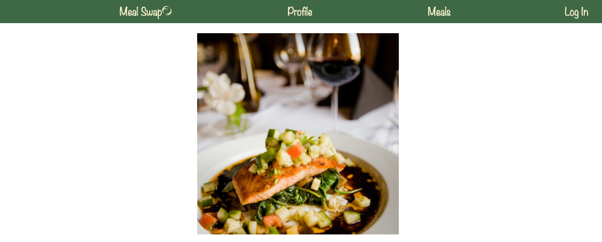

- Once a user is logged in - the NavBar changes color and shows all the options available to the user and the current amount of points they have available:
  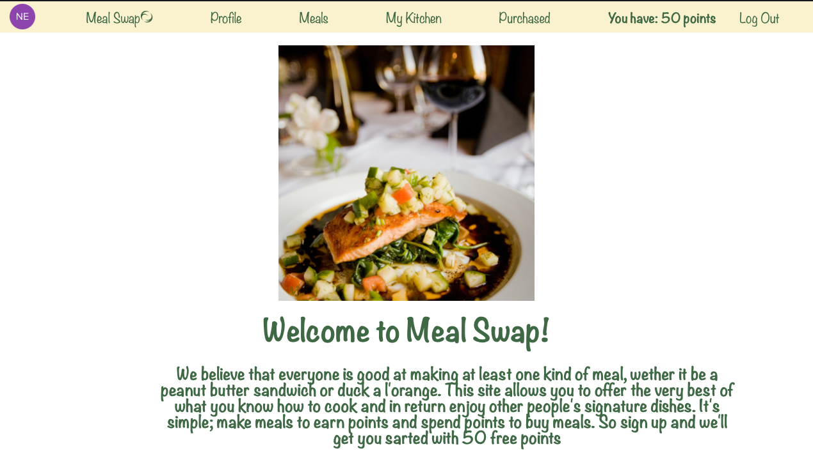

- In Profile they can see their information and by clicking update, they can add their address and change their user name.
  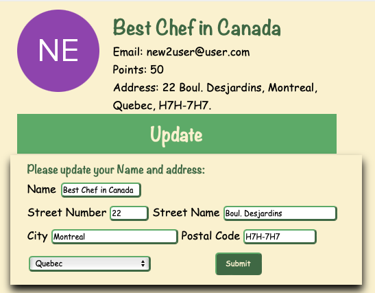

- In Meals users can see the meals offered by all users. Meals that are currently available and which cut off date is still not reach, will be highlighted (background shows green).
  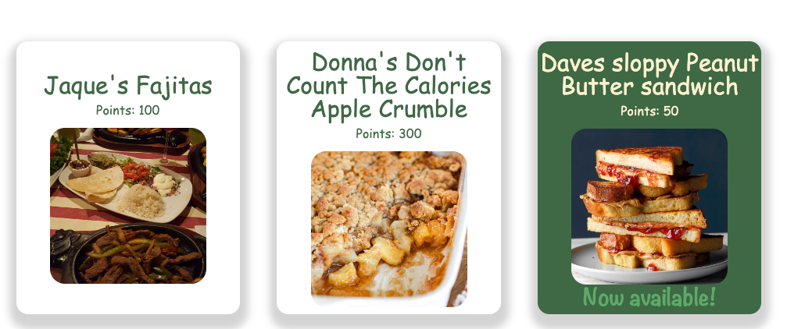

- By clicking on a meal, the user will be brought to a detail page regarding that meal. If it is your own, it will only show meal details, otherwise, it will give the option to order it.
  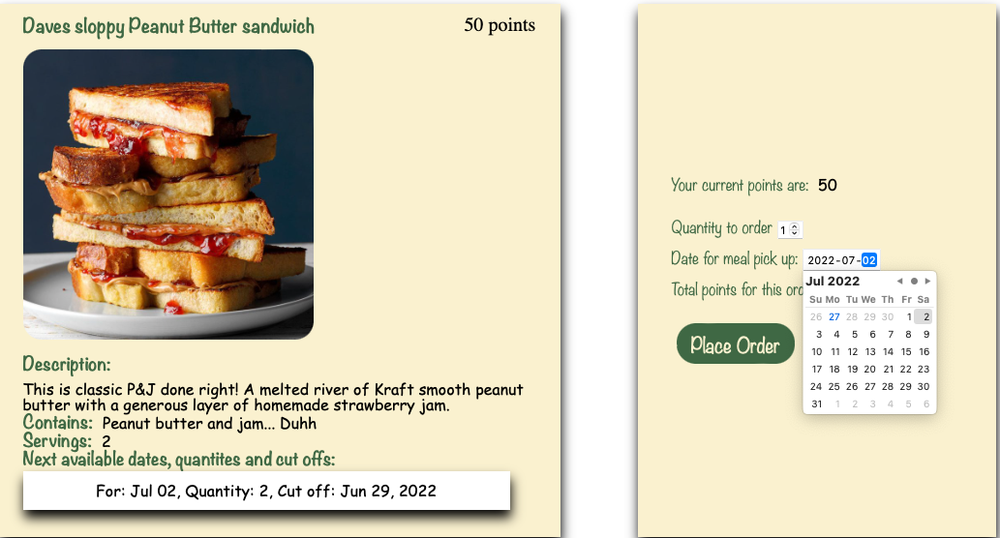
- If user have bought this meal before, it will also allow the user to leave comment.
  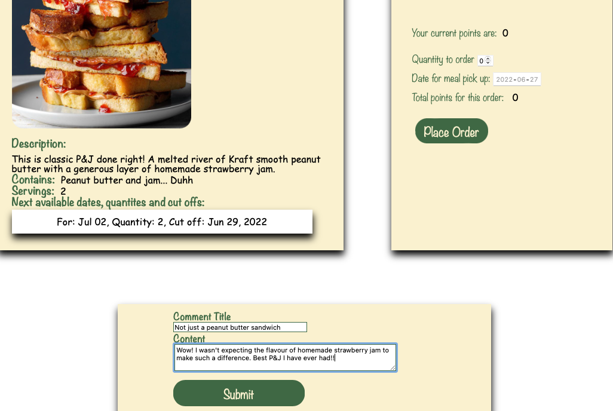

- My kitchen

  - gives the user 3 actions to choose from and shows all meals offer by user:
    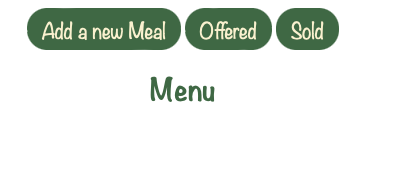

  - If it is a new user, no meals will appear. Clicking on a meal, will bring the user to a detail page, where the user can edit, delete or offer a meal.
    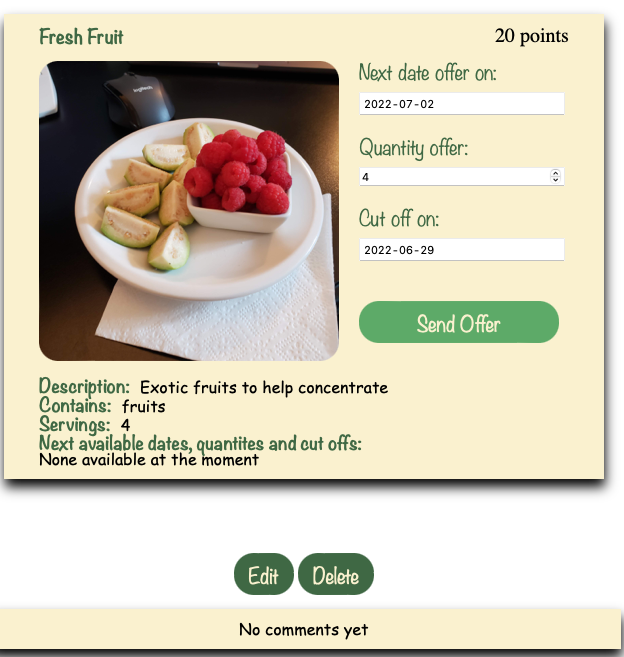

  - To Add a new Meal - The user can upload an image of the meal and fill out the boxes as necesary.
    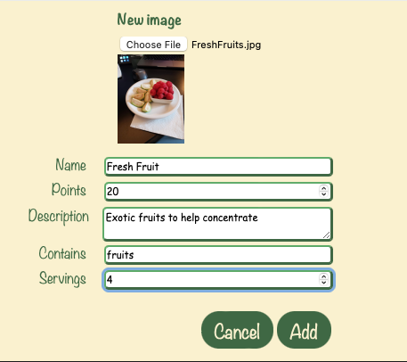

  - Offered will show the meals that the user offered. They disappear the day after the delivery date.
    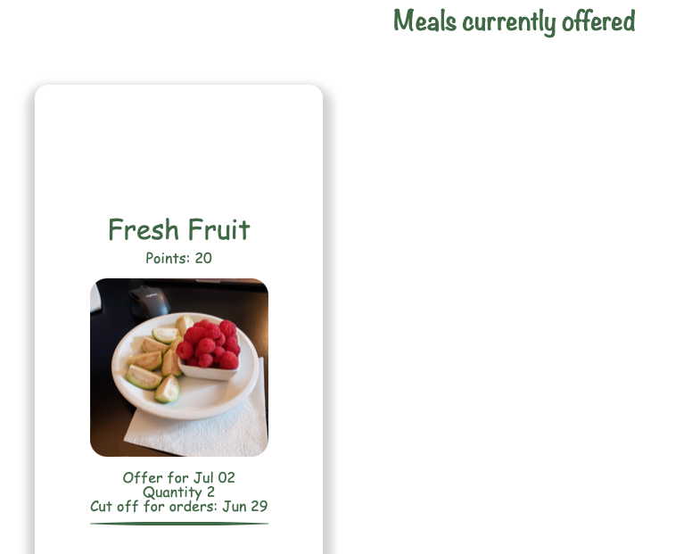

  - Sold will show all the meals that the user sold and are pending to deliver (today and for the future). If user clicks View History, it will show the meals sold before today.
    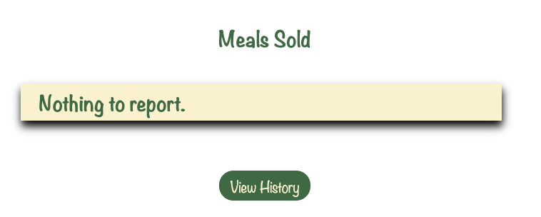

- Purchased allows the user to see meals that were bought. It will show meals current meals (that will be receive today or in the future). To see previous purchases, click View History.
  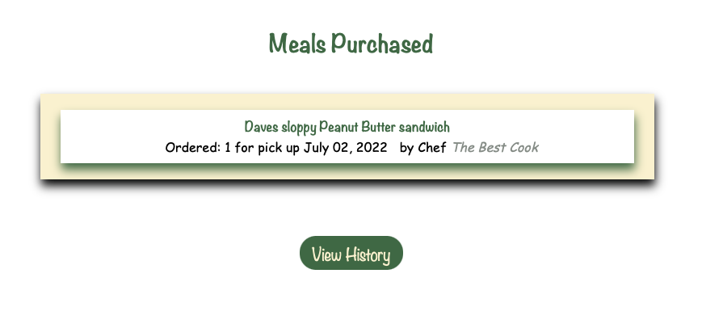
